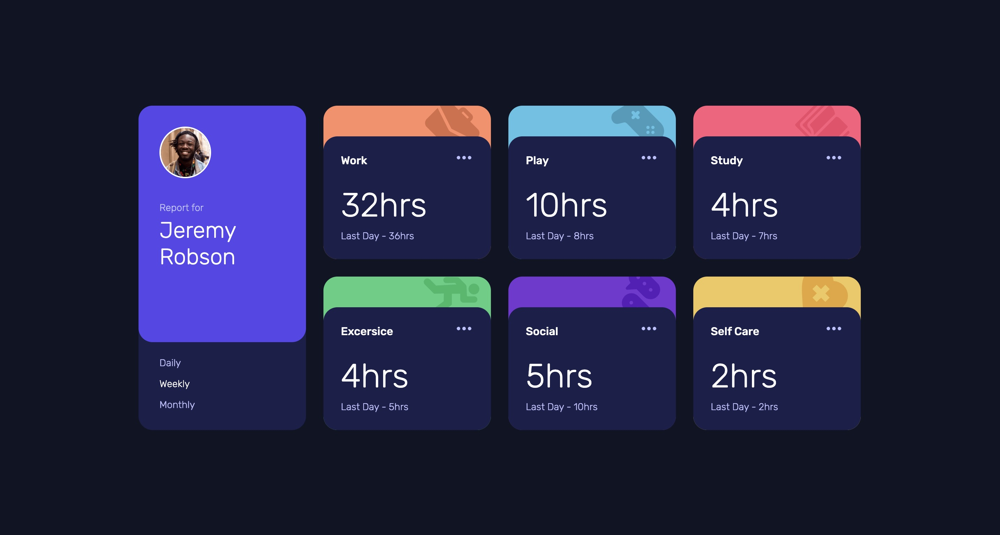

# Frontend Mentor - Time tracking dashboard solution

This is a solution to the [Time tracking dashboard challenge on Frontend Mentor](https://www.frontendmentor.io/challenges/time-tracking-dashboard-UIQ7167Jw). Frontend Mentor challenges help you improve your coding skills by building realistic projects.

## Table of contents

- [Overview](#overview)
  - [The challenge](#the-challenge)
  - [Screenshot](#screenshot)
  - [Links](#links)
- [My process](#my-process)
  - [What I learned](#what-i-learned)
- [Author](#author)

## Overview

### The challenge

Users should be able to:

- View the optimal layout for the site depending on their device's screen size
- See hover states for all interactive elements on the page
- Switch between viewing Daily, Weekly, and Monthly stats

### Screenshot



### Links

- Solution URL: [Github Pages](https://your-solution-url.com)
- Live Site URL: [Frontend Mentor](https://your-live-site-url.com)

## My process

### What I learned

For this challenge I learned about reading data from a JSON file using the `fetch()` method of promises. I want to do this first challenges using plain HTML, CSS & JS to get a good understanding of the basics and then move on to other libraries/frameworks.

I'm sure that there's a way to make the design responsive but I couldn't get to it so I used media quieries to get the job done.

```js
let timefr = "";
switch (id) {
  case "Day":
    timefr = "daily";
    break;

  case "Week":
    timefr = "weekly";
    break;

  case "Month":
    timefr = "monthly";
    break;

  default:
    break;
}
times.forEach((element, ind) => {
  element.textContent = `${json[ind].timeframes[timefr].current}hrs`;
});
```

This part of the code was needed to prevent code repetition but I'm sure that there are better ways and I'll learn from others when reviewing their solutions. Also I didn't know that brackets could be used to dynamically access properties so that was a plus (thx chatGPT)

## Author

- Frontend Mentor - [@yourusername](https://www.frontendmentor.io/profile/shiguita)
